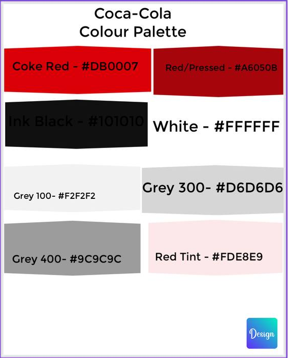

# Mini Design System — Coca-Cola

A small design system built around Coca-Cola's brand identity: a colour palette, an 8-step typography scale, 8 reusable UI components, and 2 sample screens that reuse those components consistently.

**Brand:** Coca-Cola (coursework concept)
**Components:** 8
**Sample screens:** 2

> This is an original UI kit inspired by Coca-Cola's public brand identity (its red, and its energetic, friendly tone) for a design-systems coursework exercise. It doesn't reproduce Coca-Cola's official logo, custom typeface, or any proprietary assets.

---

## Colour palette

Hand-built and screenshotted directly in Canva:

| Colour | Hex | Use |
|---|---|---|
| Coke Red | `#DB0007` | Primary |
| Red / Pressed | `#A6050B` | Active / pressed state |
| Ink Black | `#101010` | Text, navigation |
| White | `#FFFFFF` | Surfaces |
| Grey 100 | `#F2F2F2` | Backgrounds |
| Grey 300 | `#D6D6D6` | Borders |
| Grey 400 | `#9C9C9C` | Muted text |
| Red Tint | `#FDE8E9` | Focus / highlight |

## Typography scale

| Style | Size / line height | Font |
|---|---|---|
| Display | 40 / 48 | Poppins 700 |
| H1 | 28 / 34 | Poppins 700 |
| H2 | 22 / 28 | Poppins 600 |
| H3 | 18 / 24 | Poppins 600 |
| Body Large | 16 / 24 | Inter 400 |
| Body | 14 / 20 | Inter 400 |
| Caption | 12 / 16 | Inter 500 |
| Button label | 14 / 20 | Inter 700, uppercase |

## Components

1. Primary button
2. Secondary button
3. Input field
4. Product card
5. Badge
6. Bottom navigation
7. Toggle switch
8. Promo banner

## Sample screens

Two screens built entirely from the components above — nothing was drawn one-off per screen:

- **Home** — promo banner, product cards, rewards summary, bottom nav
- **Redeem a code** — points balance, input field, primary + secondary buttons, toggle

Open `index.html` in a browser to see the full system and both sample screens live, or view it hosted on GitHub Pages once enabled (see below).

---

## Viewing this live

1. Go to this repo's **Settings → Pages**
2. Under "Build and deployment," set Source to "Deploy from a branch," branch `main`, folder `/ (root)`
3. Save — GitHub will publish `index.html` at `https://<your-username>.github.io/<repo-name>/`

---

*Coursework design-system exercise. Original component designs inspired by Coca-Cola's public brand identity — not affiliated with or endorsed by The Coca-Cola Company.*
